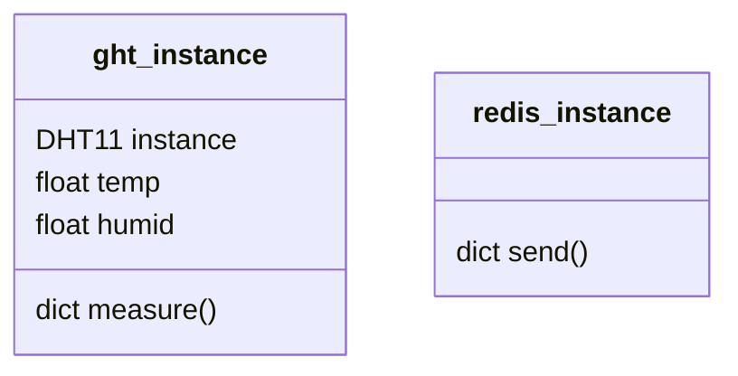

```mermaid
classDiagram

ght11からデータをとってくるクラス

 class ght_instance {
    DHT11 instance
    float temp
    float humid

    dict measure() 
 }

redisにデータを送信するクラス

 class redis_instance {

    dict send()
 }


```

receive do
  {:redix_pubsub, ^pubsub, ^ref, :subscribed, %{channel: "dht11"}} -> :ok
end