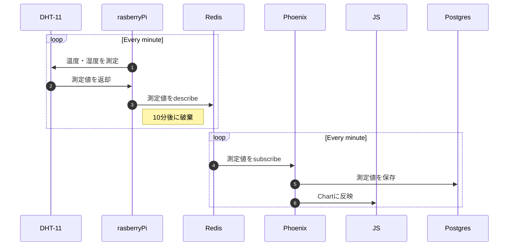

```mermaid
sequenceDiagram

    participant dht11 as DHT-11
    participant python as rasberryPi
    participant redis as Redis
    participant phoenix as Phoenix
    participant javascript as JS
    participant postgres as Postgres


    autonumber
    
    loop Every minute
        python->>dht11: 温度・湿度を測定
        dht11->>python: 測定値を返却
        python->>redis: 測定値をdescribe
        Note left of redis: 10分後に破棄
    end

    loop Every minute
        redis->>phoenix: 測定値をsubscribe
        phoenix->>postgres: 測定値を保存
        phoenix->>javascript: Chartに反映
    end
    
```